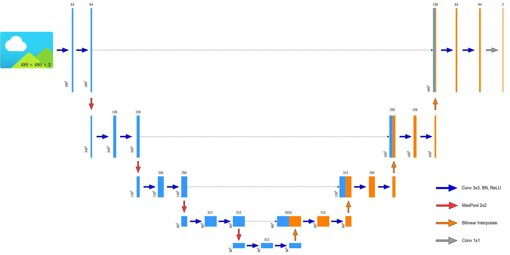
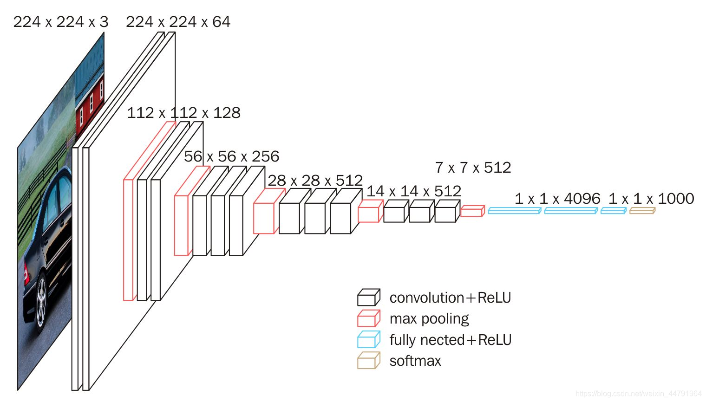
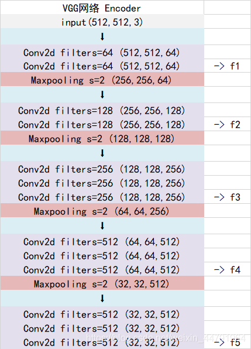
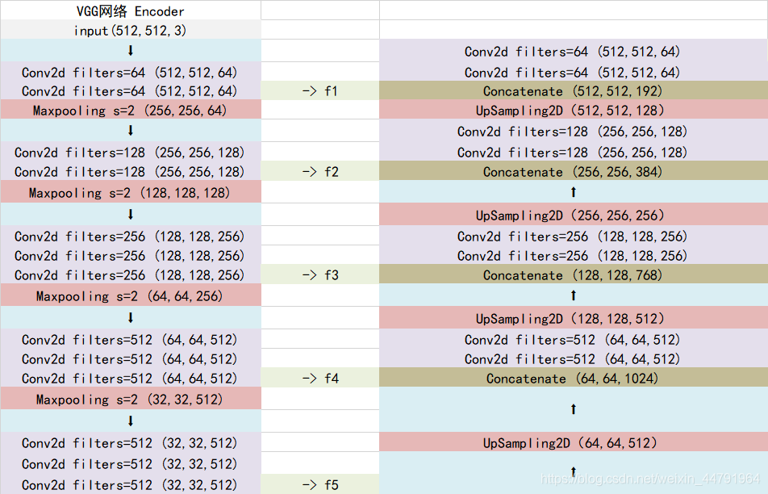
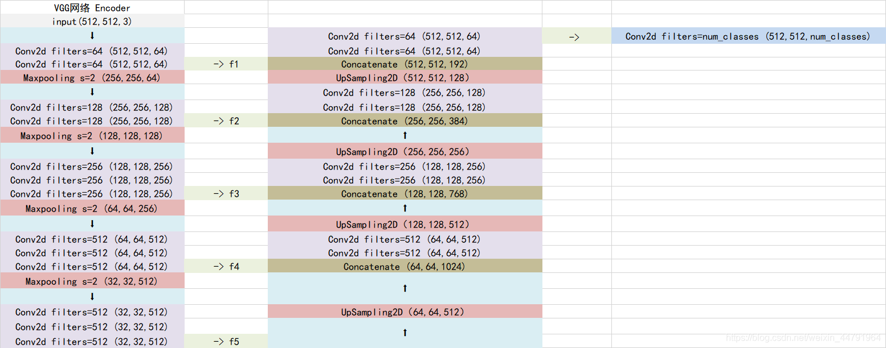
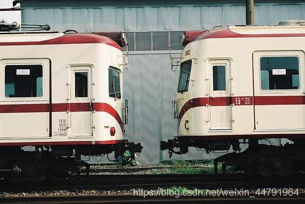
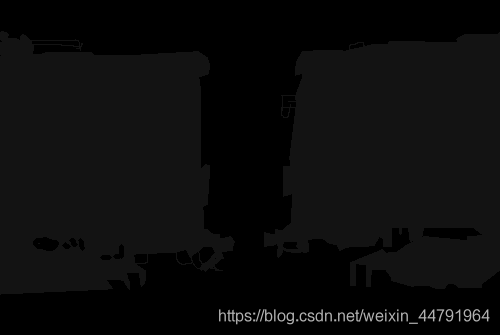
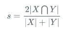

# 什么是Unet模型

Unet是一个优秀的语义分割模型，其主要执行过程与其它语义分割模型类似。

Unet可以分为三个部分，如下图所示：

第一部分是**主干特征提取部分**，我们可以**利用主干部分**获得一个又一个的**特征层**，Unet的主干特征提取部分与VGG相似，为卷积和最大池化的堆叠。**利用主干特征提取部分我们可以获得五个初步有效特征层**，在第二步中，我们会利用这五个有效特征层可以进行特征融合。

第二部分是**加强特征提取部分**，我们可以利用主干部分获取到的**五个初步有效特征层**进行上采样，并且进行特征融合，获得一个最终的，融合了**所有特征的有效特征层**。

第三部分是**预测部分**，我们会利用**最终获得的最后一个有效特征层**对每一个特征点进行分类，相当于对每一个像素点进行分类。


# 代码下载

Github源码下载地址为：

https://github.com/bubbliiiing/unet-pytorch

# Unet实现思路

## 一、预测部分

### 1、主干网络介绍




Unet的主干特征提取部分由卷积+最大池化组成，整体结构与VGG类似。

本文所采用的主干特征提取网络为VGG16，这样也方便使用imagnet上的预训练权重。

VGG是由Simonyan 和Zisserman在文献《Very Deep Convolutional Networks for Large Scale Image Recognition》中提出卷积神经网络模型，其名称来源于作者所在的牛津大学视觉几何组(Visual Geometry Group)的缩写。

该模型参加2014年的 ImageNet图像分类与定位挑战赛，取得了优异成绩：在分类任务上排名第二，在定位任务上排名第一。

它的结构如下图所示：



这是一个VGG16被用到烂的图，但确实很好的反应了VGG16的结构。

当我们使用VGG16作为**主干特征提取网络**的时候，我们只会用到两种类型的层，分别是**卷积层**和**最大池化层**。

当输入的图像大小为512x512x3的时候，具体执行方式如下：

1. **conv1：进行两次[3,3]的64通道的卷积，获得一个[512,512,64]的初步有效特征层，再进行2X2最大池化，获得一个[256,256,64]的特征层。**
2. **conv2：进行两次[3,3]的128通道的卷积，获得一个[256,256,128]的初步有效特征层，再进行2X2最大池化，获得一个[128,128,128]的特征层。**
3. **conv3：进行三次[3,3]的256通道的卷积，获得一个[128,128,256]的初步有效特征层，再进行2X2最大池化，获得一个[64,64,256]的特征层。**
4. **conv4：进行三次[3,3]的512通道的卷积，获得一个[64,64,512]的初步有效特征层，再进行2X2最大池化，获得一个[32,32,512]的特征层。**
5. **conv5：进行三次[3,3]的512通道的卷积，获得一个[32,32,512]的初步有效特征层。**



> nets/vgg.py

```python
"""
unet主干特征提取部分
就是将vgg16的features部分按照maxp_pool分层
将分层之前获取的特征作为提取的内容,一共提取5次,下面forward中就是
"""

import torch
import torch.nn as nn
from torch.hub import load_state_dict_from_url

class VGG(nn.Module):
    def __init__(self, features, num_classes=1000):
        super().__init__()
        self.features = features
        self.avgpool = nn.AdaptiveAvgPool2d((7, 7))
        self.classifier = nn.Sequential(
            nn.Linear(512 * 7 * 7, 4096),
            nn.ReLU(True),
            nn.Dropout(),
            nn.Linear(4096, 4096),
            nn.ReLU(True),
            nn.Dropout(),
            nn.Linear(4096, num_classes),
        )
        self._initialize_weights()

    def forward(self, x):
        # 不进行分类,只需要特征提取
        # x = self.features(x)
        # x = self.avgpool(x)
        # x = torch.flatten(x, 1)
        # x = self.classifier(x)

        feat1 = self.features[  :4 ](x)     # [512,512, 64] 0~3 池化前获取特征,下面每次都是池化前提取特征
        feat2 = self.features[4 :9 ](feat1) # [256,256,128]
        feat3 = self.features[9 :16](feat2) # [128,128,256]
        feat4 = self.features[16:23](feat3) # [ 64, 64,512]
        feat5 = self.features[23:-1](feat4) # [ 32, 32,512] 不要最后的max_pool
        return [feat1, feat2, feat3, feat4, feat5]

    def _initialize_weights(self):
        for m in self.modules():
            if isinstance(m, nn.Conv2d):
                nn.init.kaiming_normal_(m.weight, mode='fan_out', nonlinearity='relu')
                if m.bias is not None:
                    nn.init.constant_(m.bias, 0)
            elif isinstance(m, nn.BatchNorm2d):
                nn.init.constant_(m.weight, 1)
                nn.init.constant_(m.bias, 0)
            elif isinstance(m, nn.Linear):
                nn.init.normal_(m.weight, 0, 0.01)
                nn.init.constant_(m.bias, 0)


def make_layers(cfg, batch_norm=False, in_channels = 3):
    layers = []
    for v in cfg:
        if v == 'M':
            layers += [nn.MaxPool2d(kernel_size=2, stride=2)]
        else:
            conv2d = nn.Conv2d(in_channels, v, kernel_size=3, padding=1)
            if batch_norm:
                layers += [conv2d, nn.BatchNorm2d(v), nn.ReLU(inplace=True)]
            else:
                layers += [conv2d, nn.ReLU(inplace=True)]
            in_channels = v
    return nn.Sequential(*layers)

# 512,512,3 -> 512,512,64 -> 256,256,128 -> 128,128,256 -> 64,64,512 -> 32,32,512
cfgs = {
    # 数字是out_channel,最后的池化再unet中没有用到
    'D': [64, 64, 'M', 128, 128, 'M', 256, 256, 256, 'M', 512, 512, 512, 'M', 512, 512, 512, 'M']
}


def VGG16(pretrained, in_channels = 3, **kwargs):
    model = VGG(make_layers(cfgs["D"], batch_norm = False, in_channels = in_channels), **kwargs)
    if pretrained:
        state_dict = load_state_dict_from_url("https://download.pytorch.org/models/vgg16-397923af.pth", model_dir="./model_data")
        model.load_state_dict(state_dict)

    del model.avgpool
    del model.classifier
    return model
```

### 2、加强特征提取结构


Unet所使用的**加强特征提取网络是一个U的形状。**

利用第一步我们可以获得**五个初步的有效特征层**，在加强特征提取网络这里，我们会利用这五个**初步的有效特征层进行特征融合**，**特征融合的方式**就是**对特征层进行上采样并且进行堆叠**。

为了方便网络的构建与更好的通用性，我们的Unet和上图的Unet结构有些许不同，在**上采样时直接进行两倍上采样再进行特征融合**，最终获得的特征层和输入图片的高宽相同。

具体示意图如下：



> nets/unet.py

```python
"""
加强特征提取网络
将低层数据上采样和上层数据cat到一起,再进行两次卷积即可
"""

import torch
import torch.nn as nn

from nets.resnet import resnet50
from nets.vgg import VGG16


class unetUp(nn.Module):
    """
    上采样
    将低层数据上采样和上层数据cat到一起,再进行两次卷积即可
    """
    def __init__(self, in_size, out_size):
        super().__init__()
        # 宽高变为2倍
        self.up     = nn.UpsamplingBilinear2d(scale_factor = 2)
        # 特征融合
        # in_size = 下层通道+上层通道
        self.conv1  = nn.Conv2d(in_size, out_size, kernel_size = 3, padding = 1)
        self.conv2  = nn.Conv2d(out_size, out_size, kernel_size = 3, padding = 1)
        self.relu   = nn.ReLU(inplace = True)

    def forward(self, inputs1, inputs2):
        """
        inputs1: 上层
        inputs2: 下层,要上采样
        """
        # 上采样
        outputs = torch.cat([inputs1, self.up(inputs2)], 1)
        # 卷积
        outputs = self.conv1(outputs)
        outputs = self.relu(outputs)
        outputs = self.conv2(outputs)
        outputs = self.relu(outputs)
        return outputs

class Unet(nn.Module):
    def __init__(self, num_classes = 21, pretrained = False, backbone = 'vgg'):
        super().__init__()
        # in_filters = 下层通道+上层通道
        if backbone == 'vgg':
            self.vgg    = VGG16(pretrained = pretrained)
            in_filters  = [192, 384, 768, 1024]
        elif backbone == "resnet50":
            self.resnet = resnet50(pretrained = pretrained)
            in_filters  = [192, 512, 1024, 3072]
        else:
            raise ValueError('Unsupported backbone - `{}`, Use vgg, resnet50.'.format(backbone))
        # 上采样并拼接后最终调整为这些维度
        out_filters = [64, 128, 256, 512]

        # vgg upsampling 从下到上
        # [32, 32, 512] up+cat [64, 64, 512] => [64, 64, 512]
        self.up_concat4 = unetUp(in_filters[3], out_filters[3])
        # [64, 64, 512] up+cat [128,128,256] => [128,128,256]
        self.up_concat3 = unetUp(in_filters[2], out_filters[2])
        # [128,128,256] up+cat [256,256,128] => [256,256,128]
        self.up_concat2 = unetUp(in_filters[1], out_filters[1])
        # [256,256,128] up+cat [512,512, 64] => [512,512, 64]
        self.up_concat1 = unetUp(in_filters[0], out_filters[0])

        # resnet50还要在进行一次上采样,因为resnet的feat1大小经过了压缩一次 [256,256,64] => [512,512,64]
        if backbone == 'resnet50':
            self.up_conv = nn.Sequential(
                nn.UpsamplingBilinear2d(scale_factor = 2),
                nn.Conv2d(out_filters[0], out_filters[0], kernel_size = 3, padding = 1),
                nn.ReLU(),
                nn.Conv2d(out_filters[0], out_filters[0], kernel_size = 3, padding = 1),
                nn.ReLU(),
            )
        else:
            self.up_conv = None

        # 最终通道变为分类数
        # [512,512,64] => [512,512,num_classes]
        self.final = nn.Conv2d(out_filters[0], num_classes, 1)

        self.backbone = backbone

    def forward(self, inputs):
        if self.backbone == "vgg":
            # 宽高 512 256 128 64 32
            [feat1, feat2, feat3, feat4, feat5] = self.vgg.forward(inputs)
        elif self.backbone == "resnet50":
            # 宽高 256 128 64 32 16
            [feat1, feat2, feat3, feat4, feat5] = self.resnet.forward(inputs)

        #                     上层   下层
        up4 = self.up_concat4(feat4, feat5)
        up3 = self.up_concat3(feat3, up4)
        up2 = self.up_concat2(feat2, up3)
        up1 = self.up_concat1(feat1, up2)   # out: [512,512,64]

        # resnet才使用
        if self.up_conv != None:
            up1 = self.up_conv(up1)

        final = self.final(up1)

        return final
```

### 3、利用特征获得预测结果

利用1、2步，我们可以获取输入进来的图片的特征，此时，我们需要利用特征获得预测结果。

利用特征获得预测结果的过程为：

**利用一个1x1卷积进行通道调整，将最终特征层的通道数调整成num_classes。**



> nets/unet.py

```python
"""
加强特征提取网络
将低层数据上采样和上层数据cat到一起,再进行两次卷积即可
"""

import torch
import torch.nn as nn

from nets.resnet import resnet50
from nets.vgg import VGG16


class unetUp(nn.Module):
    """
    上采样
    将低层数据上采样和上层数据cat到一起,再进行两次卷积即可
    """
    def __init__(self, in_size, out_size):
        super().__init__()
        # 宽高变为2倍
        self.up     = nn.UpsamplingBilinear2d(scale_factor = 2)
        # 特征融合
        # in_size = 下层通道+上层通道
        self.conv1  = nn.Conv2d(in_size, out_size, kernel_size = 3, padding = 1)
        self.conv2  = nn.Conv2d(out_size, out_size, kernel_size = 3, padding = 1)
        self.relu   = nn.ReLU(inplace = True)

    def forward(self, inputs1, inputs2):
        """
        inputs1: 上层
        inputs2: 下层,要上采样
        """
        # 上采样
        outputs = torch.cat([inputs1, self.up(inputs2)], 1)
        # 卷积
        outputs = self.conv1(outputs)
        outputs = self.relu(outputs)
        outputs = self.conv2(outputs)
        outputs = self.relu(outputs)
        return outputs

class Unet(nn.Module):
    def __init__(self, num_classes = 21, pretrained = False, backbone = 'vgg'):
        super().__init__()
        # in_filters = 下层通道+上层通道
        if backbone == 'vgg':
            self.vgg    = VGG16(pretrained = pretrained)
            in_filters  = [192, 384, 768, 1024]
        elif backbone == "resnet50":
            self.resnet = resnet50(pretrained = pretrained)
            in_filters  = [192, 512, 1024, 3072]
        else:
            raise ValueError('Unsupported backbone - `{}`, Use vgg, resnet50.'.format(backbone))
        # 上采样并拼接后最终调整为这些维度
        out_filters = [64, 128, 256, 512]

        # vgg upsampling 从下到上
        # [32, 32, 512] up+cat [64, 64, 512] => [64, 64, 512]
        self.up_concat4 = unetUp(in_filters[3], out_filters[3])
        # [64, 64, 512] up+cat [128,128,256] => [128,128,256]
        self.up_concat3 = unetUp(in_filters[2], out_filters[2])
        # [128,128,256] up+cat [256,256,128] => [256,256,128]
        self.up_concat2 = unetUp(in_filters[1], out_filters[1])
        # [256,256,128] up+cat [512,512, 64] => [512,512, 64]
        self.up_concat1 = unetUp(in_filters[0], out_filters[0])

        # resnet50还要在进行一次上采样,因为resnet的feat1大小经过了压缩一次 [256,256,64] => [512,512,64]
        if backbone == 'resnet50':
            self.up_conv = nn.Sequential(
                nn.UpsamplingBilinear2d(scale_factor = 2),
                nn.Conv2d(out_filters[0], out_filters[0], kernel_size = 3, padding = 1),
                nn.ReLU(),
                nn.Conv2d(out_filters[0], out_filters[0], kernel_size = 3, padding = 1),
                nn.ReLU(),
            )
        else:
            self.up_conv = None

        # 最终通道变为分类数
        # [512,512,64] => [512,512,num_classes]
        self.final = nn.Conv2d(out_filters[0], num_classes, 1)

        self.backbone = backbone

    def forward(self, inputs):
        if self.backbone == "vgg":
            # 宽高 512 256 128 64 32
            [feat1, feat2, feat3, feat4, feat5] = self.vgg.forward(inputs)
        elif self.backbone == "resnet50":
            # 宽高 256 128 64 32 16
            [feat1, feat2, feat3, feat4, feat5] = self.resnet.forward(inputs)

        #                     上层   下层
        up4 = self.up_concat4(feat4, feat5)
        up3 = self.up_concat3(feat3, up4)
        up2 = self.up_concat2(feat2, up3)
        up1 = self.up_concat1(feat1, up2)   # out: [512,512,64]

        # resnet才使用
        if self.up_conv != None:
            up1 = self.up_conv(up1)

        final = self.final(up1)

        return final
```

## 二、训练部分

### 1、训练文件详解

我们使用的训练文件采用VOC的格式。
语义分割模型训练的文件分为两部分。
第一部分是原图，像这样：



第二部分标签，像这样：



原图就是普通的RGB图像，标签就是灰度图或者8位彩色图。

**原图的shape为[height, width, 3]，标签的shape就是[height, width]，对于标签而言，每个像素点的内容是一个数字，比如0、1、2、3、4、5……，代表这个像素点所属的类别。**

语义分割的工作就是对原始的图片的每一个像素点进行分类，**所以通过预测结果中每个像素点属于每个类别的概率与标签对比，可以对网络进行训练。**

### 2、LOSS解析

本文所使用的LOSS由两部分组成：

1. **Cross Entropy Loss。**
2. **Dice Loss。**

**Cross Entropy Loss就是普通的交叉熵损失，当语义分割平台利用Softmax对像素点进行分类的时候，进行使用。**

Dice loss将语义分割的评价指标作为Loss，**Dice系数是一种集合相似度度量函数，通常用于计算两个样本的相似度，取值范围在[0,1]。**

计算公式如下：



就是**预测结果和真实结果的交乘上2**，除上**预测结果加上真实结果**。其值在0-1之间。越大表示预测结果和真实结果重合度越大。**所以Dice系数是越大越好。**

如果作为LOSS的话是越小越好，所以使得Dice loss = 1 - Dice，就可以将Loss作为语义分割的损失了。

> nets/unet_training.py

```python
import torch
import torch.nn as nn
import torch.nn.functional as F
from torch import nn

def CE_Loss(inputs, target, cls_weights, num_classes=21):
    n, c, h, w = inputs.size()
    nt, ht, wt = target.size()
    if h != ht and w != wt:
        inputs = F.interpolate(inputs, size=(ht, wt), mode="bilinear", align_corners=True)

    temp_inputs = inputs.transpose(1, 2).transpose(2, 3).contiguous().view(-1, c)
    temp_target = target.view(-1)

    CE_loss  = nn.CrossEntropyLoss(weight=cls_weights, ignore_index=num_classes)(temp_inputs, temp_target)
    return CE_loss

def Focal_Loss(inputs, target, cls_weights, num_classes=21, alpha=0.5, gamma=2):
    n, c, h, w = inputs.size()
    nt, ht, wt = target.size()
    if h != ht and w != wt:
        inputs = F.interpolate(inputs, size=(ht, wt), mode="bilinear", align_corners=True)

    temp_inputs = inputs.transpose(1, 2).transpose(2, 3).contiguous().view(-1, c)
    temp_target = target.view(-1)

    logpt  = -nn.CrossEntropyLoss(weight=cls_weights, ignore_index=num_classes, reduction='none')(temp_inputs, temp_target)
    pt = torch.exp(logpt)
    if alpha is not None:
        logpt *= alpha
    loss = -((1 - pt) ** gamma) * logpt
    loss = loss.mean()
    return loss

def Dice_loss(inputs, target, beta=1, smooth = 1e-5):
    n, c, h, w = inputs.size()
    nt, ht, wt, ct = target.size()
    if h != ht and w != wt:
        inputs = F.interpolate(inputs, size=(ht, wt), mode="bilinear", align_corners=True)

    temp_inputs = torch.softmax(inputs.transpose(1, 2).transpose(2, 3).contiguous().view(n, -1, c),-1)
    temp_target = target.view(n, -1, ct)

    #--------------------------------------------#
    #   计算dice loss
    #--------------------------------------------#
    tp = torch.sum(temp_target[...,:-1] * temp_inputs, axis=[0,1])
    fp = torch.sum(temp_inputs                       , axis=[0,1]) - tp
    fn = torch.sum(temp_target[...,:-1]              , axis=[0,1]) - tp

    score = ((1 + beta ** 2) * tp + smooth) / ((1 + beta ** 2) * tp + beta ** 2 * fn + fp + smooth)
    dice_loss = 1 - torch.mean(score)
    return dice_loss
```

